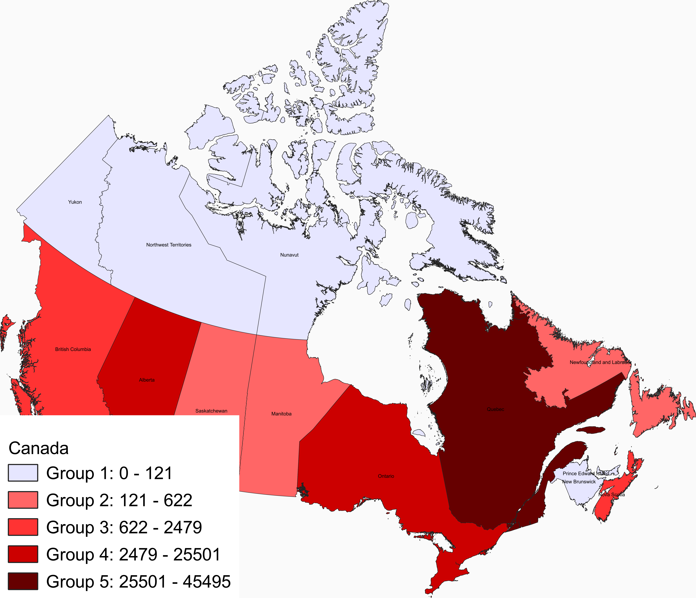
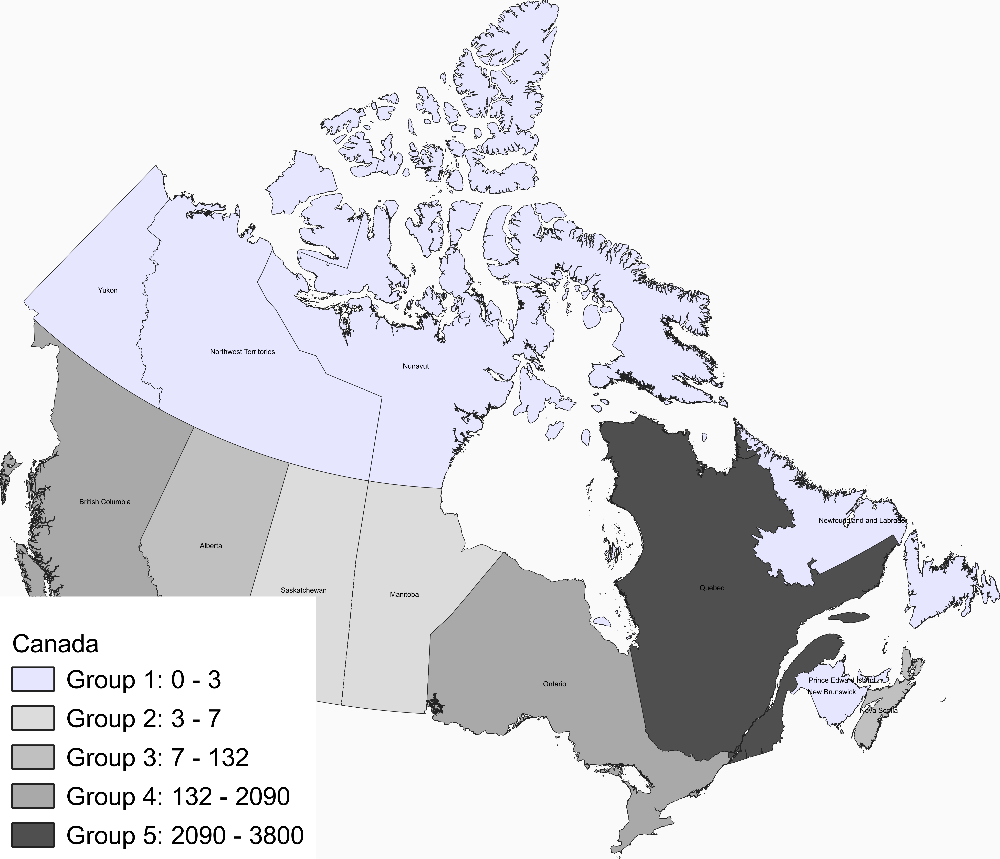
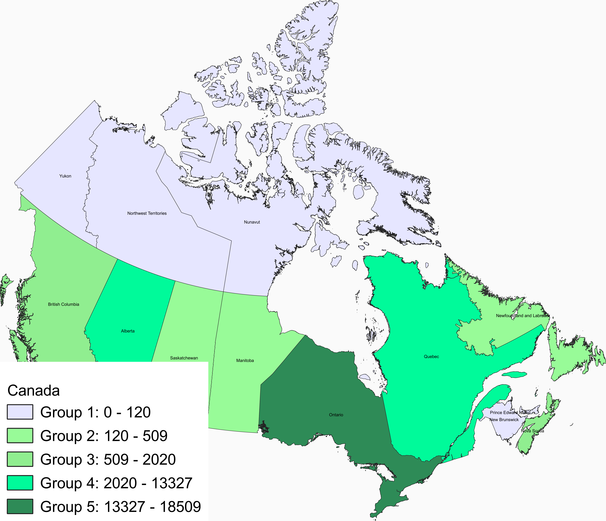
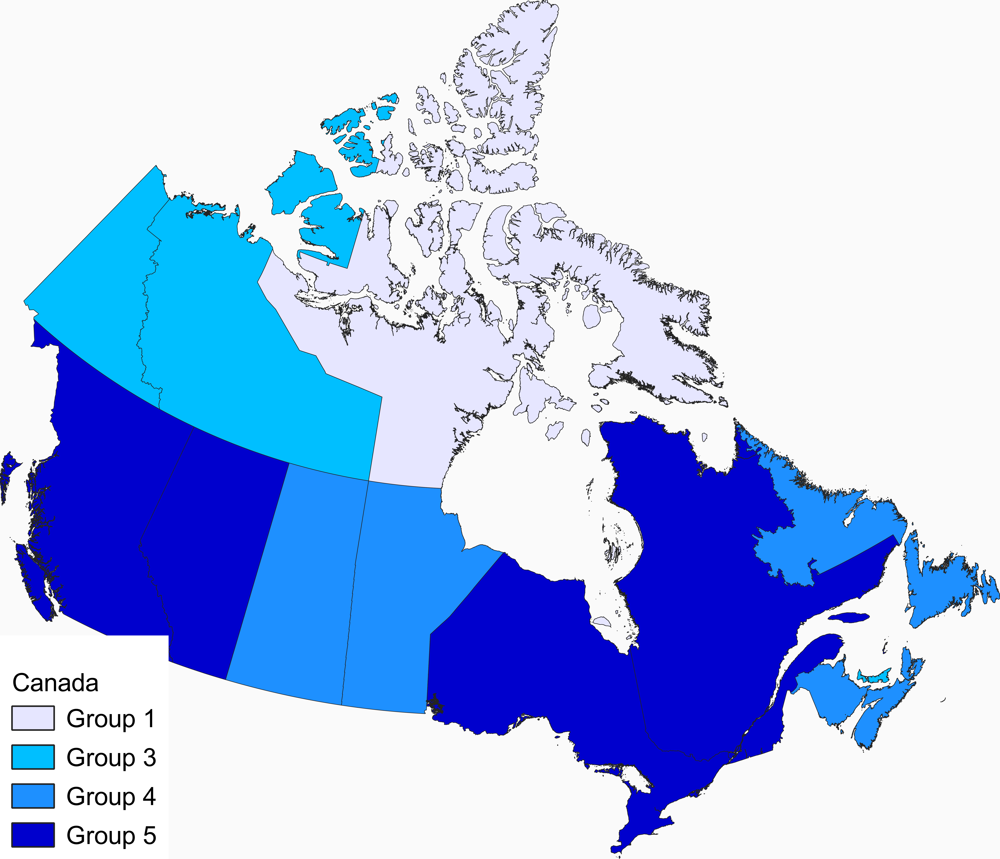
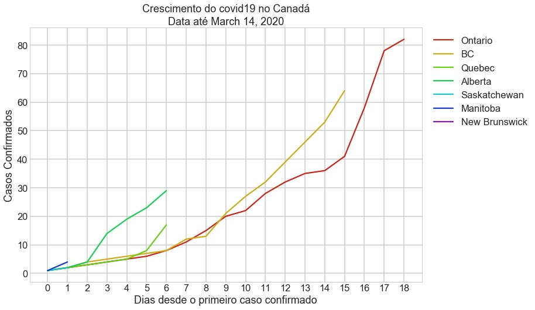

# **Projeto Covid-19 no Canadá**

## Objetivos
1. Visualização dos:
   - Casos confirmados
   - Mortes
   - Casos recuperados
   - Testes efetuados

2. Top 5 (por milhão):
   - regiões com mais casos
   - regiões com mais Mortes
   - regiões com mais casos recuperados
   - regiões com mais testes efetuados

3. Comparação da quantidade de testes efetuados com a quantidade de casos confirmados

## **Motivação**

## **Dataset**

### **Origem dos Dados**

## **Mapas com graduação de cores**

#### **Mapa dos Casos positivos**

  

#### **Mapa das Mortes**

#### **Mapa dos Recuperados**

 

#### **Mapa dos Testes efetuados**

# Os primeiros casos no Canadá : Estatísticas

### Crescimento

## Mais dados Estatísticos
