# **Projeto Covid-19 no Canadá**

## Objetivos
1. Visualização dos:
   - Casos confirmados
   - Mortes
   - Casos recuperados
   - Testes efetuados

2. Top 3:
   - regiões com mais casos
   - regiões com mais Mortes
   - regiões com mais casos recuperados
   - regiões com mais testes efetuados

3. Comparação da quantidade de testes efetuados com a quantidade de casos confirmados

## **Motivação**

O objetivo para este projeto foi estudar a propagação de Covid-19 no Canadá especifícamente de forma a compreender qual o desempenho do vírus nesse País. Desenvolveu-se portanto um conjunto de notebooks que ajudam a entender o avanço da pandemia, desde os primeiros casos, até aos últimos dias.

## **Dataset**
### **Origem dos Dados**
https://github.com/ishaberry/Covid19Canada - Informação relativa aos dados do Covid-19 no Canadá, tais como número de infetados, recuperados, mortes e testes efetuados.

https://www12.statcan.gc.ca/census-recensement/2011/geo/bound-limit/bound-limit-2016-eng.cfm - Aqui podem ser encontrados os dados em ficheiro shp para a contrução do mapa do Canadá em QGIS

## **Mapas com graduação de cores**

Nesta secção podemos visualizar 4 Mapas do Canadá. Em todos, o código de cor é o mesmo, ou seja, quanto mais escura for a cor, mais casos existem para aquela provincia. 

No primeiro caso, no mapa com tons de vermelho, encontram-se os casos positivos de Covid-19. Seguidamente, no mapa em tons cinzentos, encontram-se as mortes sofridas devido ao vírus. A seguir, encontram-se um mapa, em tons de verde que retrata o número de pessoas que já recuperaram da doença. Por último, no mapa em tons de azul estão representados  os testes já efetuados.

  

 

 
 
 
 
 
 
 
 
 
 
 
 
 
 
 
 
 
 
 
 
 
 
 
 
 
 
 
 
 
 
 
 
 

# **Os primeiros casos no Canadá : Estatísticas**

Numa primeira fase, foram apenas analizados os primeiros 200 casos de infeção por Covid-19 no Canadá, referentes aos 18 primeiros dias desde o primeiro caso identificado da doença, isto de forma a conseguir uma análise mais específica do contágio inicial.  Assim como primeiro gráfico pode-se observar o crescimento dos casos de covid-19 nas diversas provincias do Canadá.

No segundo gráfico encontra-se a distribuição por idades dos 200 primeiros casos e no terceiro a distribuição por sexo.

Por último, podemos verificar de onde foram importados os primeiros casos confirmados.
.
## **Crescimento**

   
  
 
 
 
 

## **Distribuíção por idades e por sexo**

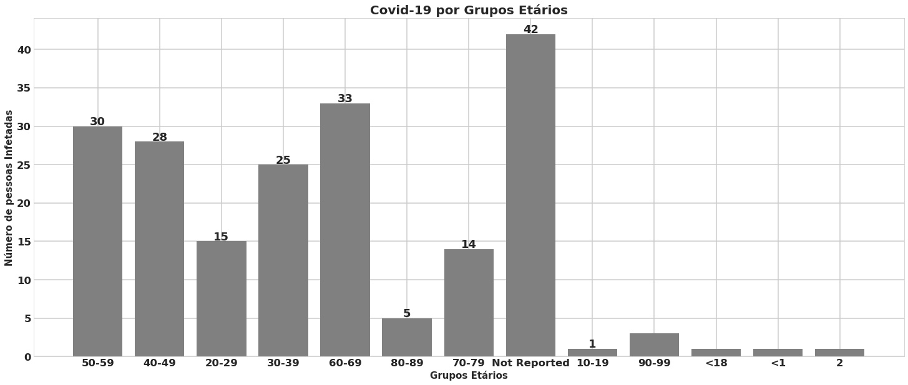 
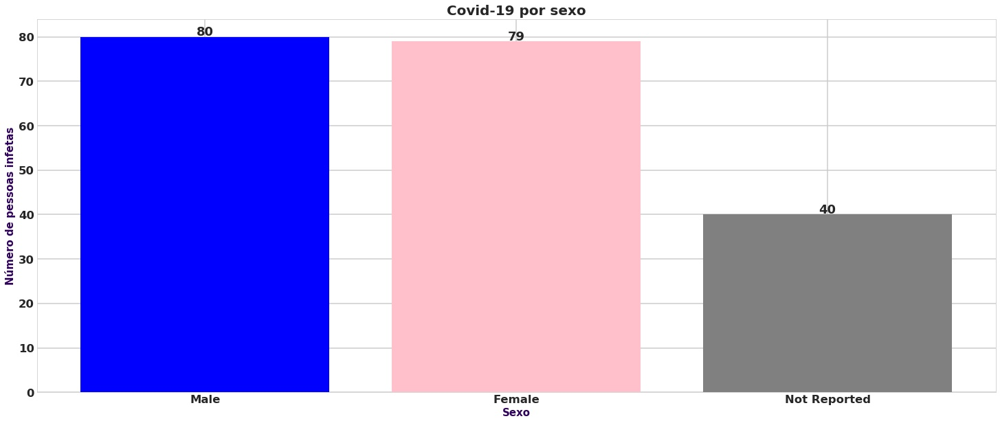

 
 
 
 
 
 
 

## **Distribuição de casos importados**

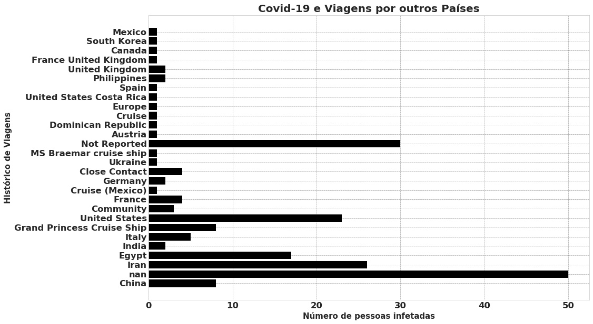
 
 
 
 
 
 

## **Mais dados Estatísticos**
 

### **Top 3 de Casos Confirmados e Bottom 3 de Casos confirmados**

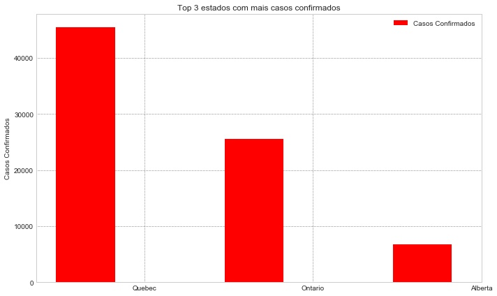 
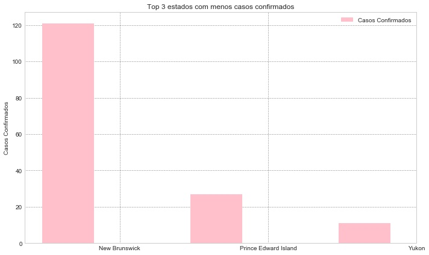

 
 
 
 
 
 
 
 
 
 
 
   
### **Top 3 Provincias com mais Mortes e Bottom 3 Provicias com monos Mortes**

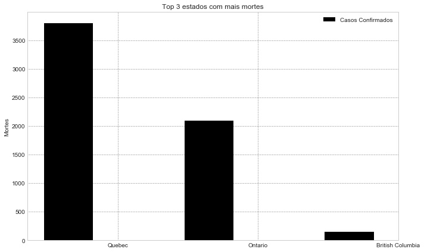 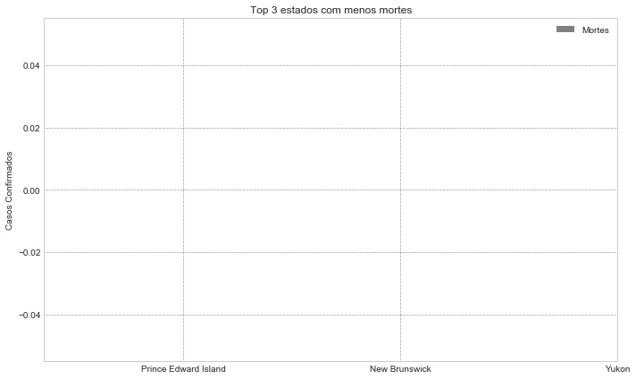

 
 
 
 
 
 
 
 
 
 
 
 
   
### **Top 3 casos Recuperados e Comparação das 3 provincias mais afetadas**

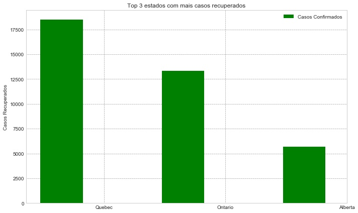 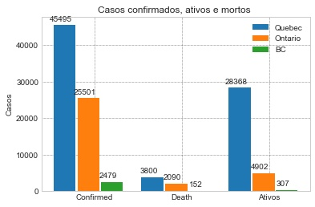

 
 
 
 
 
 
 
 
 
 
 
 

## Caso da Provincia Ontário
 

### Casos confimados por dia

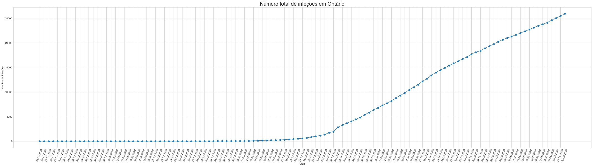
 
 
 
 
 
 
 
   
### Testes efetuados por dia

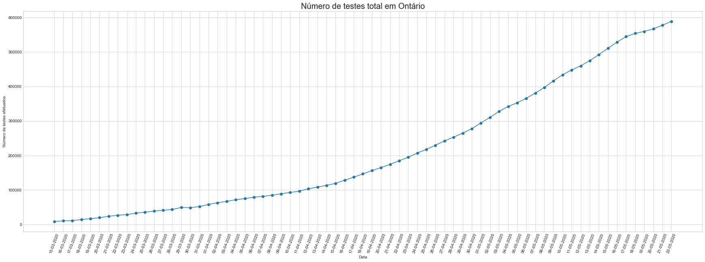
 
 
 
 
 
 
 
 
